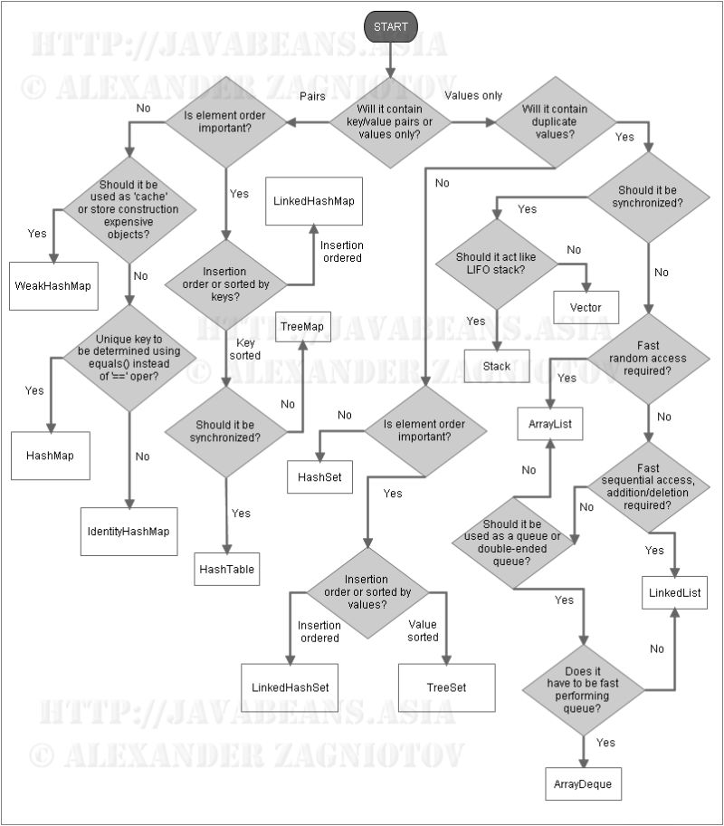

# java-collection-concepts-2
Having fun writing and exploring collection classes and their usages.

1. ### [Stack](https://levelup.gitconnected.com/visualize-design-and-analyse-the-stack-data-structure-b32e285563c1)
   > The Stack class represents a last-in-first-out (LIFO) stack of objects. It extends class Vector with five operations that allow a vector to be treated as a stack. The usual push and pop operations are provided, as well as a method to peek at the top item on the stack, a method to test for whether the stack is empty, and a method to search the stack for an item and discover how far it is from the top.
   When a stack is first created, it contains no items.

   > A more complete and consistent set of LIFO stack operations is provided by the Deque interface and its implementations, which should be used in preference to this class. For example:
   Deque<Integer> stack = new ArrayDeque<Integer>();
2. ### Queue and Deque
    1. #### PriorityQueue (implements Queue)
    2. #### ArrayDeque (implements Deque and Deque extends Queue)
    3. #### LinkedList (implements Deque and Deque extends Queue)
3. ### List
    1. #### [ArrayList](https://medium.com/@basecs101/comparing-arraylist-and-linkedlist-in-java-latest-2b133b29489f)
    2. #### [LinkedList](https://medium.com/@basecs101/comparing-arraylist-and-linkedlist-in-java-latest-2b133b29489f)
4. ### Set
    1. #### [HashSet](https://medium.com/@basecs101/internal-working-of-hashset-in-java-interview-question-129bdd31fc60)
    2. #### [LinkedHashSet](https://medium.com/@basecs101/complete-guide-on-linkedhashmap-in-java-latest-a923833afde0)
    3. #### TreeSet
5. ### Map
    1. #### [HashMap](https://medium.com/@basecs101/internal-working-of-hashmap-in-java-latest-updated-4c2708f76d2c)

    2. #### [LinkedHashMap](https://medium.com/@basecs101/complete-guide-on-linkedhashmap-in-java-latest-a923833afde0)
    3. #### [TreeMap](https://medium.com/@basecs101/treemap-in-java-collection-framework-interview-question-a3f81c7aaa84)
6. ### HashTable
7. ### Vector
   >    The Vector class implements a growable array of objects. Like an array, it contains components that can be accessed using an integer index. However, the size of a Vector can grow or shrink as needed to accommodate adding and removing items after the Vector has been created.

   >    Each vector tries to optimize storage management by maintaining a capacity and a capacityIncrement. The capacity is always at least as large as the vector size; it is usually larger because as components are added to the vector, the vector's storage increases in chunks the size of capacityIncrement. An application can increase the capacity of a vector before inserting a large number of components; this reduces the amount of incremental reallocation.

   >    As of the Java 2 platform v1.2, this class was retrofitted to implement the List interface, making it a member of the Java Collections Framework. Unlike the new collection implementations, Vector is synchronized. If a thread-safe implementation is not needed, it is recommended to use ArrayList in place of Vector
8. ### Collections.sort(List<E> list) and Arrays.sort(<Array>)
9. ### Comparator and Comparable Interfaces and their differences
10. ### [HashMap and ConcurrentHashMap](https://medium.com/@basecs101/comparing-hashmap-and-concurrenthashmap-in-java-latest-98fc845ec70c)
11. ### Immutable Collections in Java 9
    1. > List.of(<list>) --> returns immutable List
    #### > Use cases
         1. While passing list as param to a method that doesn't modify it.
         2. Use it when multiple threads are sharing the list and you want the same list to be used by all threads.
## Collection flow diagram

